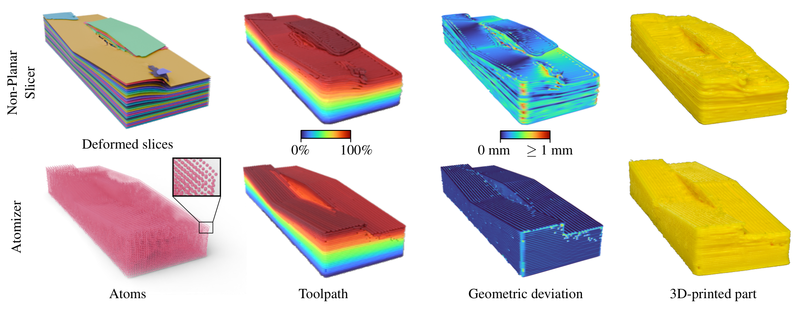
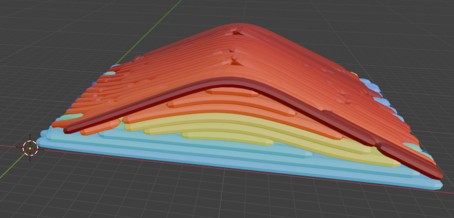

# Atomizer: Beyond Non-Planar Slicing for Fused Filament Fabrication



This repository contains the implementation of **Atomizer**, a novel toolpath generation algorithm for fused filament fabrication (FFF) 3D printing. Atomizer introduces the concept of *atoms* as a replacement for traditional slices. This method enables collision-free toolpaths that tightly conform to complex geometries and offer new fabrication capabilities.

- [Project page](https://xavierchermain.github.io/publications/atomizer)
- [Article (preprint)](https://drive.google.com/file/d/1P4MiYd7Qz1rJdqrq3-CEuzC4vQ2PIMeO/view?usp=sharing)
- [Supplemental Video](https://youtu.be/d9SBcfkywqA)

*[Xavier Chermain](https://xavierchermain.github.io), [Giovanni Cocco](https://github.com/iota97), [Cédric Zanni](https://members.loria.fr/CZanni/), Eric Garner, [Pierre-Alexandre Hugron](https://www.linkedin.com/in/pierre-alexandre-hugron-b7b22552), and [Sylvain Lefebvre](https://www.antexel.com/sylefeb/research)*

[Université de Lorraine](https://www.univ-lorraine.fr/en/univ-lorraine/), [CNRS](https://www.cnrs.fr/en), [Inria](https://www.inria.fr/en), [Loria](https://www.loria.fr/en/)

[Computer Graphics Forum](https://doi.org/10.1111/cgf.70189) ([Proceedings of the Symposium on Geometry Processing](https://sgp2025.my.canva.site/program-page-sgp)), 2025

## Key Features

* Toolpath generation using frames (i.e., atoms) instead of slices
* Control of the deposition direction and tool orientation
* Collision-free toolpath ordering
* Support for anisotropic appearance on curved surfaces

## Installation

### Clone the Repository

```
git clone https://github.com/xavierchermain/atomizer
```

### Install Python and Module Dependencies

This implementation is written in Python 3.10. Supported versions are Python >= 3.7 and < 3.11, as required by the [Taichi](https://www.taichi-lang.org/) module dependency. The implementation also relies on the local library [`src/atom`](src/atom). Please refer to [`pyproject.toml`](pyproject.toml) for the complete list of Python module dependencies.

#### Conda

We recommend using [Miniconda](https://www.anaconda.com/docs/getting-started/miniconda/install) to install a specific version of Python, the dependencies, and the local library [`src/atom`](src/atom):

```
conda create --name atomizer python=3.10
conda activate atomizer
conda install pip
pip install --user -e .
```

#### Blender

**Blender is also a dependency.** You need to install it and add it to your executable path. It is used to remesh the model (see [`tools/process_for_atomizer.py`](tools/process_for_atomizer.py)) for the atomizer. We use Blender 4.4.

## Usage

### Atomize

```
python tools/atomize.py data/param/<json_filename>.json
```


The parameters in the JSON file are:

* `solid_name`: the filename of the STL representing the 3D solid, without the extension. The STL file must be located in the `data/mesh/` folder and have the `.stl` extension.
* `deposition_width`: the deposition width in millimeters. The layer height is half the deposition width in our implementation.
* `max_slope`: the maximum tilting angle of the tool, in degrees.
* `top_lines` and `bottom_lines` (optional): paths to single-channel, 8-bit-per-pixel PNG files representing the target tangent directions for the top and bottom surfaces, respectively. The mapping is $\[0, 255] \leftarrow \[−\pi/2, \pi/2]\$. The orientation defines a 2D line in the xy-plane. The 2D line field is defined on the upper face of the solid’s bounding box and is planarly projected onto the top and bottom surfaces along the z-axis.
* `ortho_to_wall` (optional): if true, forces the tool orientation to be parallel to the boundary. By default, this is false, as enabling this feature causes many tool orientation changes that are detrimental to surface quality.

The inputs and outputs are:

* **STL input:** `data/mesh/<json_filename>.stl`
* **Toolpath output:** `data/toolpath/<json_filename>.npz`
* **Log file:** `data/log/<json_filename>.log`

Refer to the log file to see all the individual computation and visualization commands.

Add the `--warmup` option to exclude the compilation time from the computation time reported in the log file. **Caution:** this causes each step of the pipeline to run twice, as Taichi uses just-in-time compilation.

#### Example

```
python tools/atomize.py data/param/triangle_24.json
```

### Visualize

After using the atomizer, you can visualize the generated `<toolpath>` with:

```
python tools/visualize_toolpath.py data/toolpath/<toolpath>.npz
```
Use the `WASD` keys to move the camera. Press `H` to hide the travel paths.

Check the log file generated by the atomizer tool to see all individual visualization commands.

#### Example

```
python tools/visualize_toolpath.py data/toolpath/triangle_24_smoothed.npz
```

#### Export Toolpath Mesh



```
python tools/toolpath_to_ply.py data/toolpath/<toolpath>.npz data/mesh/<toolpath>.ply
```

The generated mesh `<toolpath>.ply` can be visualized in Blender. To display the toolpath relative length using the Turbo colormap, you need to add a material to the mesh. Then, in the **Material** tab, do the following:

1. Select **Base Color**.
2. Choose **Color Attribute**.

To visualize the vertex color attribute:

1. Select **Shading** (shortcut **z**).
2. Choose **Material Preview** (shortcut **2**).

### Commands Manuals

Tool manuals are accessible by typing `--help`, e.g.,
```
python tools/atomize.py --help
```

## Repository Structure

```
atomizer/
├── tools/                             # The main tools
|    └── atomize.py                    # Main pipeline entry point
|    └── bpn_to_sdf.py                 # SDF generation and voxelization
|    └── compute_tool_orientations.py  # Tool orientation field optimization
|    └── compute_tangents.py           # Deposition tangent field optimization
|    └── align_atoms.py                # Tricosine field optimization
|    └── extract_explicit_atoms.py     # Atom extraction
|    └── order_atoms.py                # Atom ordering
|    └── visualize_bpn_sdf.py          # Visualize SDF
|    └── visualize_bpn_df.py           # Visualize tool orientation field
|    └── visualize_bases.py            # Visualize deposition tangent field
|    └── visualize_implicit_atoms.py   # Visualize tricosine field
|    └── visualize_explicit_atoms.py   # Visualize explicit atoms
|    └── visualize_toolpath.py         # Visualize generated toolpath
|    └── ...                           # Other tools
├── data/                              # Input and output data
|    └── mesh/                         # Input STLs
|    └── param/                        # Input parameter JSON files
|    └── toolpath/                     # Output toolpaths
|    └── ...                           # Other data
├── src/atom/                          # Local library with core functionalities
├── experiment/                        # To experiment some core functionalities
├── generate_results.ps1               # Script generating the toolpaths
└── README.md
```

## 3D Printer

Atomizer was tested on a custom 3-axis printer with independently controlled Z-axis screws. The custumization is for experts, and consequently, we do not provide any GCODE to prevent people damaging their machine. The code only generates the sequence of positions, each associated with a tool orientation and a travel type (deposition or no deposition). The generated toolpaths are in [`data/toolpath`](data/toolpath). To print, you have to use your machine inverse kinematics model.

## Citation

If you use this code in your research, please cite:

```
@article{Chermain2025Atomizer,
author = {Chermain, Xavier and Cocco, Giovanni and Zanni, Cédric and Garner, Eric and Hugron, Pierre-Alexandre and Lefebvre, Sylvain},
title = {{Atomizer: Beyond Non-Planar Slicing for Fused Filament Fabrication}},
journal = {Computer Graphics Forum (Proceedings of the Symposium on Geometry Processing)},
year = {2025}
doi = {https://doi.org/10.1111/cgf.70189},
}
```

## License

The source code is under the BSD 3-Clause "New" or "Rivised" license. See
[LICENSE](LICENSE) for more details.
